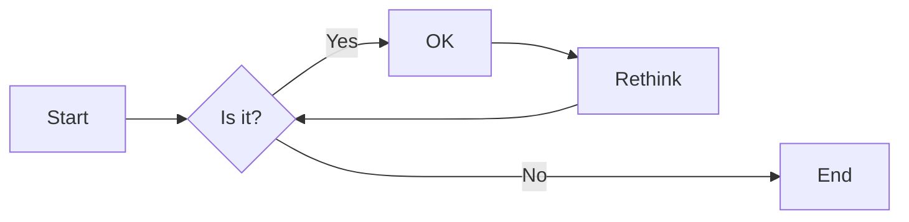
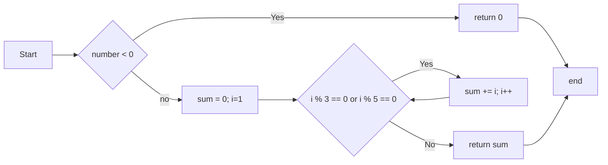
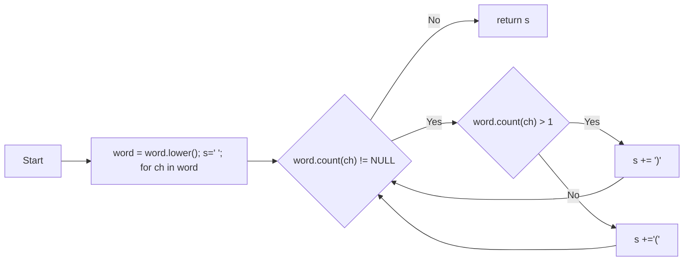

# 实验三 Python列表

班级： 21计科2

学号： B20210302212

姓名： 李欣

Github地址：<https://github.com/sdgalk/lixin>

CodeWars地址：<https://www.codewars.com/users/lx666>

---

## 实验目的

1. 学习Python的简单使用和列表操作
2. 学习Python中的if语句

## 实验环境

1. Git
2. Python 3.10
3. VSCode
4. VSCode插件

## 实验内容和步骤

### 第一部分

Python列表操作

完成教材《Python编程从入门到实践》下列章节的练习：

- 第3章 列表简介
- 第4章 操作列表
- 第5章 if语句

---

### 第二部分

在[Codewars网站](https://www.codewars.com)注册账号，完成下列Kata挑战：

---

#### 第一题：3和5的倍数（Multiples of 3 or 5）

难度： 6kyu

如果我们列出所有低于 10 的 3 或 5 倍数的自然数，我们得到 3、5、6 和 9。这些数的总和为 23. 完成一个函数，使其返回小于某个整数的所有是3 或 5 的倍数的数的总和。此外，如果数字为负数，则返回 0。

注意：如果一个数同时是3和5的倍数，应该只被算一次。

**提示：首先使用列表解析得到一个列表，元素全部是3或者5的倍数。
使用sum函数可以获取这个列表所有元素的和.**

代码提交地址：
<https://www.codewars.com/kata/514b92a657cdc65150000006>

---

#### 第二题： 重复字符的编码器（Duplicate Encoder）

难度： 6kyu

本练习的目的是将一个字符串转换为一个新的字符串，如果新字符串中的每个字符在原字符串中只出现一次，则为"("，如果该字符在原字符串中出现多次，则为")"。在判断一个字符是否是重复的时候，请忽略大写字母。

例如:

```python
"din"      =>  "((("
"recede"   =>  "()()()"
"Success"  =>  ")())())"
"(( @"     =>  "))(("
```

代码提交地址:
<https://www.codewars.com/kata/54b42f9314d9229fd6000d9c>

---

#### 第三题：括号匹配（Valid Braces）

难度：6kyu

写一个函数，接收一串括号，并确定括号的顺序是否有效。如果字符串是有效的，它应该返回True，如果是无效的，它应该返回False。
例如：

```python
"(){}[]" => True 
"([{}])" => True
 "(}" => False
 "[(])" => False 
"[({})](]" => False
```

**提示：
python中没有内置堆栈数据结构，可以直接使用`list`来作为堆栈，其中`append`方法用于入栈，`pop`方法可以出栈。**

代码提交地址
<https://www.codewars.com/kata/5277c8a221e209d3f6000b56>

---

#### 第四题： 从随机三元组中恢复秘密字符串(Recover a secret string from random triplets)

难度： 4kyu

有一个不为你所知的秘密字符串。给出一个随机三个字母的组合的集合，恢复原来的字符串。

这里的三个字母的组合被定义为三个字母的序列，每个字母在给定的字符串中出现在下一个字母之前。"whi "是字符串 "whatisup "的一个三个字母的组合。

作为一种简化，你可以假设没有一个字母在秘密字符串中出现超过一次。

对于给你的三个字母的组合，除了它们是有效的三个字母的组合以及它们包含足够的信息来推导出原始字符串之外，你可以不做任何假设。特别是，这意味着秘密字符串永远不会包含不出现在给你的三个字母的组合中的字母。

测试用例：

```python
secret = "whatisup"
triplets = [
  ['t','u','p'],
  ['w','h','i'],
  ['t','s','u'],
  ['a','t','s'],
  ['h','a','p'],
  ['t','i','s'],
  ['w','h','s']
]
test.assert_equals(recoverSecret(triplets), secret)
```

代码提交地址：
<https://www.codewars.com/kata/53f40dff5f9d31b813000774/train/python>

提示：

- 利用集合去掉`triplets`中的重复字母，得到字母集合`letters`，最后的`secret`应该由集合中的字母组成，`secret`长度也等于该集合。

```python
letters = {letter for triplet in triplets for letter in triplet }
length = len(letters)
```

- 创建函数`check_first_letter(triplets, first_letter)`，检测一个字母是不是secret的首字母，返回True或者False。
- 创建函数`remove_first_letter(triplets, first_letter)`,  从三元组中去掉首字母，返回新的三元组。
- 遍历字母集合letters，利用上面2个函数得到最后的结果`secret`。

---

#### 第五题： 去掉喷子的元音（Disemvowel Trolls）

难度： 7kyu

喷子正在攻击你的评论区!
处理这种情况的一个常见方法是删除喷子评论中的所有元音(字母：a,e,i,o,u)，以消除威胁。
你的任务是写一个函数，接收一个字符串并返回一个去除所有元音的新字符串。
例如，字符串 "This website is for losers LOL!"   将变成 "Ths wbst s fr lsrs LL!".

注意：对于这个Kata来说，y不被认为是元音。
代码提交地址：
<https://www.codewars.com/kata/52fba66badcd10859f00097e>

提示：

- 首先使用列表解析得到一个列表，列表中所有不是元音的字母。
- 使用字符串的join方法连结列表中所有的字母，例如：

```python
last_name = "lovelace"
letters = [letter for letter in last_name ]
print(letters) # ['l', 'o', 'v', 'e', 'l', 'a', 'c', 'e']
name = ''.join(letters) # name = "lovelace"
```

---

### 第三部分

使用Mermaid绘制程序流程图

安装VSCode插件：

- Markdown Preview Mermaid Support
- Mermaid Markdown Syntax Highlighting

使用Markdown语法绘制你的程序绘制程序流程图（至少一个），Markdown代码如下：


显示效果如下：



查看Mermaid流程图语法-->[点击这里](https://mermaid.js.org/syntax/flowchart.html)

使用Markdown编辑器（例如VScode）编写本次实验的实验报告，包括[实验过程与结果](#实验过程与结果)、[实验考查](#实验考查)和[实验总结](#实验总结)，并将其导出为 **PDF格式** 来提交。

## 实验过程与结果

请将实验过程与结果放在这里，包括：

- [第一部分 Python列表操作和if语句](#第一部分)
- [第二部分 Codewars Kata挑战](#第二部分)

  第一题  
  ```
  def solution(number):
    if number < 0:
        return 0
        sum = 0
        for i in range(1,number):
        if i % 3 == 0 or i % 5 == 0:
            sum += i
            return sum
  ```  
    第二题  
  ```
  def duplicate_encode(word):
    word = word.lower()
    s = ''
    for ch in word:
        if word.count(ch) > 1:
            s += ')'
        else :
            s += '('
    return s
  ```  
  第三题

    ```
  def valid_braces(string):
    s = []
    mapping = {")": "(", "}": "{", "]": "["}
    for char in string:
        if char in mapping:
            if not s or s.pop() != mapping[char]:
                return False
        else:
            s.append(char)
    return len(s) == 0
  ```  


  第五题  
  ```
  def disemvowel(string_):
    
    s = "aeiouAEIOU"
    res = ""
    
    for char in string_:
        if char not in s:
            res += char
    
    return res
  ```
- [第三部分 使用Mermaid绘制程序流程图](#第三部分)
    第一题流程图  

第二题流程图

第三题流程图
```
flowchart LR
    A[Start] --> B[s = []; mapping = {""")"": ""("", ""}"": ""{"",""]"": ""["}"]
    B --> C{"word.count(ch) != NULL"}
    C -->|No| E[return s]
    C -->|Yes| D{"word.count(ch) > 1"}
    D -->|Yes| F["s += ')'"]
    D -->|No| G["s +='('"]
    F --> C
    G --> C
```

注意代码需要使用markdown的代码块格式化，例如Git命令行语句应该使用下面的格式：


显示效果如下：

```bash
git init
git add .
git status
git commit -m "first commit"
```

如果是Python代码，应该使用下面代码块格式，例如：


显示效果如下：

```python
def add_binary(a,b):
    return bin(a+b)[2:]
```

代码运行结果的文本可以直接粘贴在这里。

**注意：不要使用截图，Markdown文档转换为Pdf格式后，截图可能会无法显示。**

## 实验考查

请使用自己的语言并使用尽量简短代码示例回答下面的问题，这些问题将在实验检查时用于提问和答辩以及实际的操作。

1. Python中的列表可以进行哪些操作？
   
   答： Python中的列表是一种序列类型，它可以进行以下操作：
1.索引：通过下标获取列表中的元素。
2.切片：通过下标范围获取列表中的元素。
3.加法：将两个列表合并为一个新的列表。
4.乘法：将一个列表重复多次，生成一个新的列表。
5.成员资格：判断某个元素是否在列表中。
6.长度：获取列表中元素的个数。
7.最大值：获取列表中元素的最大值。
8.最小值：获取列表中元素的最小值。

2. 哪两种方法可以用来对Python的列表排序？这两种方法有和区别？
   
    答：sort()和sorted()。其中，sort()是列表的成员方法，它会直接修改原列表，而sorted()是内置函数，它会返回一个新的排好序的列表，而不会改变原有的列表。

3. 如何将Python列表逆序打印？
   
   答：1.使用切片操作：使用切片操作[::-1]来逆序输出Python中的列表。2.使用reverse()方法：使用reverse()方法可以直接修改原有的列表。3.使用reversed()函数和list()函数：使用reversed()函数和list()函数可以返回一个新的逆序的列表。

4. Python中的列表执行哪些操作时效率比较高？哪些操作效率比较差？是否有类似的数据结构可以用来替代列表？
   
   答：Python中的列表是一种动态数组，可以改变大小和内容。列表的访问和修改元素速度都非常快，复杂度为O(1)。但是，改变数组的内容和大小需要额外的内存和计算，改变数组大小的复杂度为O(N)。因此，当需要高效地添加或删除元素时，可以使用Python中的collections.deque。它是一个双端队列，支持从两端添加或删除元素，并且具有O(1)的复杂度。如果需要按照顺序访问元素，可以使用Python中的元组。元组是静态数组，其内部数据一旦创建便无法改变，缓存于Python运行时的环境，所以每次使用元组时无需访问内核分配内存。 
   
5. 阅读《Fluent Python》Chapter 2. An Array of Sequence - Tuples Are Not Just Immutable Lists小节（p30-p35）。总结该小节的主要内容。

   答：本小节主要讲解了元组的这两种用法，以及如何使用元组进行记录和解包。此外，本小节还介绍了Python中的切片操作和多维切片操作，以及如何使用加号和乘号与序列进行操作。


## 实验总结

总结一下这次实验你学习和使用到的知识，例如：编程工具的使用、数据结构、程序语言的语法、算法、编程技巧、编程思想。

通过本次实验我学习了Python的简单使用和列表操作，学习了Python中的if语句的使用。并且让我对Python编程有了更深的了解，对Python的编程语法也更加熟悉。
